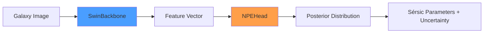
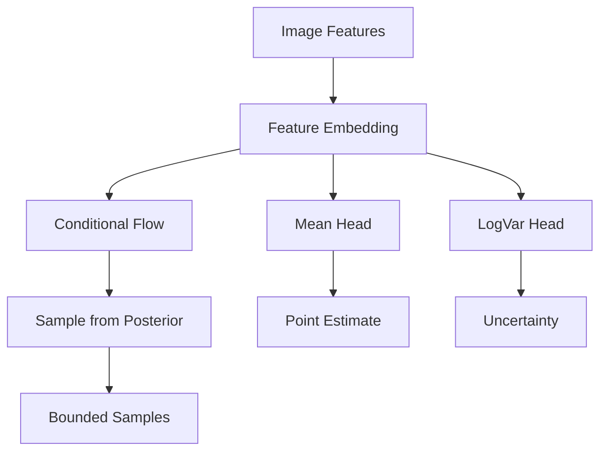
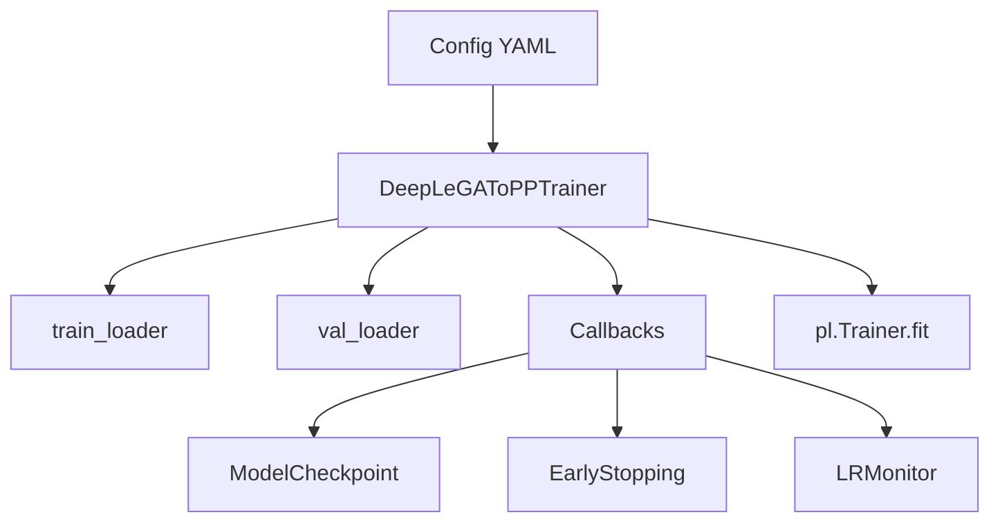
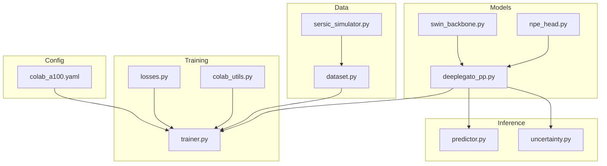

# DeepLeGATo++ Architecture Analysis

A comprehensive guide to understanding the DeepLeGATo++ codebase and building similar neural posterior estimation systems.

---

## High-Level Architecture



**Core Pipeline:**
1. **Input**: Galaxy image (128x128 grayscale)
2. **Feature Extraction**: Swin Transformer V2 backbone → 768-dim feature vector
3. **Posterior Estimation**: Normalizing Flow NPE head → full posterior distribution
4. **Output**: 7 Sérsic parameters with uncertainty quantification

---

## Module Breakdown

### 1. Models (`deeplegato_pp/models/`)

#### [deeplegato_pp.py](file:///d:/Space/DeepLeGATo++/deeplegato_pp/models/deeplegato_pp.py)

Main model class combining backbone and NPE head.

| Component | Purpose |
|-----------|---------|
| `DeepLeGAToPP` | Main model orchestrating feature extraction → posterior estimation |
| `forward()` | Returns posterior samples, mean, and std |
| `predict()` | Inference with credible intervals |
| `compute_loss()` | Training loss computation |
| `from_config()` | Factory method from YAML config |

**Key Design Patterns:**
- **Composition**: Combines backbone + head as separate modules
- **Factory Pattern**: `from_config()` and `from_pretrained()` class methods
- **Dictionary Returns**: All methods return rich dictionaries with multiple outputs

---

#### [swin_backbone.py](file:///d:/Space/DeepLeGATo++/deeplegato_pp/models/swin_backbone.py)

Swin Transformer V2 for galaxy image feature extraction.

```python
# Core flow
features = swin.forward_features(image)  # Extract spatial features
features = features.mean(dim=1)          # Global average pooling
features = feature_proj(features)         # Project to fixed dimension
```

| Feature | Purpose |
|---------|---------|
| Pre-trained weights | Transfer learning from ImageNet |
| Gradient checkpointing | Memory efficiency for large models |
| `_adaptive_proj` | Dynamic projection layer for dimension matching |

> [!TIP]
> **For similar projects**: Use `timm.create_model()` for easy access to pre-trained vision backbones. The adaptive projection pattern handles dimension mismatches gracefully.

---

#### [npe_head.py](file:///d:/Space/DeepLeGATo++/deeplegato_pp/models/npe_head.py)

Neural Posterior Estimation using Normalizing Flows.



**Key Components:**

| Component | Purpose |
|-----------|---------|
| `feature_embedding` | Project backbone features for flow conditioning |
| `flow` (nflows MAF) | Masked Autoregressive Flow for posterior |
| `mean_head`, `logvar_head` | Gaussian approximation backup |
| `_to_bounded()` | Sigmoid transform to parameter bounds |

**Parameter Bounds:**
```python
DEFAULT_BOUNDS = {
    "magnitude": (15.0, 28.0),
    "effective_radius": (0.1, 10.0),
    "sersic_index": (0.3, 8.0),
    "axis_ratio": (0.1, 1.0),
    "position_angle": (0.0, 180.0),
    "center_x": (-5.0, 5.0),
    "center_y": (-5.0, 5.0),
}
```

---

### 2. Data (`deeplegato_pp/data/`)

#### [sersic_simulator.py](file:///d:/Space/DeepLeGATo++/deeplegato_pp/data/sersic_simulator.py)

GPU-accelerated synthetic galaxy generator.

**Sérsic Profile Formula:**
```
I(r) = I_e × exp(-b_n × [(r/R_e)^(1/n) - 1])
```

| Component | Purpose |
|-----------|---------|
| `SersicParams` | Dataclass for 7 Sérsic parameters |
| `compute_bn()` | Ciotti & Bertin approximation for b_n constant |
| `generate_sersic_profile()` | Single profile generation |
| `SersicSimulator` | Batch generation with noise and PSF |

**Noise Model:**
```python
# Poisson + Gaussian noise
noisy = poisson(signal) + gaussian(read_noise)
```

---

#### [dataset.py](file:///d:/Space/DeepLeGATo++/deeplegato_pp/data/dataset.py)

PyTorch datasets for training.

| Dataset | Use Case |
|---------|----------|
| `SimulatedGalaxyDataset` | On-the-fly generation for training |
| `GalaxyDataset` | Real galaxy images from FITS files |
| `DriveDataset` | Google Drive optimized with chunk loading |
| `create_dataloaders()` | Factory function from config |

---

### 3. Training (`deeplegato_pp/training/`)

#### [trainer.py](file:///d:/Space/DeepLeGATo++/deeplegato_pp/training/trainer.py)

PyTorch Lightning training module.



**Key Methods:**

| Method | Purpose |
|--------|---------|
| `training_step()` | Forward pass + loss computation |
| `validation_step()` | Validation metrics (MAE per parameter) |
| `configure_optimizers()` | AdamW + CosineAnnealingWarmRestarts |
| `on_load_checkpoint()` | Handle dynamic layers in checkpoints |

---

#### [losses.py](file:///d:/Space/DeepLeGATo++/deeplegato_pp/training/losses.py)

Loss functions for NPE training.

| Loss | Formula | Purpose |
|------|---------|---------|
| `NPELoss` | NLL + Flow loss | Main training objective |
| `ReconstructionLoss` | MSE/L1/Huber | Self-supervised pre-training |
| `PhysicsInformedLoss` | Luminosity-size relation | Physical regularization |
| `UncertaintyCalibrationLoss` | CI coverage | Calibrated uncertainties |

---

### 4. Inference (`deeplegato_pp/inference/`)

#### [predictor.py](file:///d:/Space/DeepLeGATo++/deeplegato_pp/inference/predictor.py)

High-level inference API.

```python
# Usage example
predictor = Predictor.from_pretrained("path/to/model")
result = predictor.predict(galaxy_image, num_samples=1000)
predictor.print_results(result)
predictor.plot_posterior(result)
```

**Output Format:**
```python
{
    "params": {
        "magnitude": {"value": 22.5, "std": 0.3, "ci_lower": 21.9, "ci_upper": 23.1},
        # ... other parameters
    },
    "mean": np.array([...]),
    "samples": np.array([...])  # if return_samples=True
}
```

---

## Configuration System

```yaml
# Key sections in config YAML
model:
  backbone:
    type: "swinv2_tiny_window8_256"  # timm model name
    pretrained: true
    gradient_checkpointing: true
  npe:
    num_flow_layers: 8
    hidden_dim: 256

training:
  batch_size: 32
  precision: "16-mixed"

data:
  image_size: 128
  priors:  # Parameter sampling ranges
    magnitude: [15.0, 28.0]
```

---

## Building Something Similar

### Template for New NPE Project

```python
# 1. Define your backbone (feature extractor)
class MyBackbone(nn.Module):
    def __init__(self):
        self.encoder = timm.create_model("swinv2_tiny_window8_256", ...)
    
    def forward(self, x):
        return self.encoder.forward_features(x).mean(dim=1)

# 2. Define your NPE head
class MyNPEHead(nn.Module):
    def __init__(self, feature_dim, num_params):
        self.flow = build_normalizing_flow(num_params, context_dim=feature_dim)
        self.mean_head = nn.Linear(feature_dim, num_params)
    
    def forward(self, features, num_samples):
        samples = self.flow.sample(num_samples, context=features)
        return {"samples": samples, "mean": samples.mean(dim=1)}

# 3. Combine into main model
class MyNPEModel(nn.Module):
    def __init__(self):
        self.backbone = MyBackbone()
        self.npe_head = MyNPEHead(feature_dim=768, num_params=7)
    
    def forward(self, x):
        features = self.backbone(x)
        return self.npe_head(features)
```

### Key Dependencies

| Package | Purpose |
|---------|---------|
| `timm` | Pre-trained vision models |
| `nflows` | Normalizing flow implementations |
| `pytorch-lightning` | Training infrastructure |

### Design Decisions to Consider

1. **Backbone Choice**: Swin Transformer excellent for dense prediction; ResNet/EfficientNet simpler
2. **Flow Type**: MAF (autoregressive) vs RealNVP (coupling) - MAF more expressive but slower
3. **Parameter Bounds**: Use sigmoid/tanh transforms for bounded outputs
4. **Uncertainty Calibration**: Add calibration loss if accurate uncertainties are critical

---

## File Dependency Graph



---

## Summary

| Module | Files | Key Classes |
|--------|-------|-------------|
| **Models** | 3 | `DeepLeGAToPP`, `SwinBackbone`, `NPEHead` |
| **Data** | 3 | `SersicSimulator`, `SimulatedGalaxyDataset` |
| **Training** | 3 | `DeepLeGAToPPTrainer`, `NPELoss`, `train()` |
| **Inference** | 2 | `Predictor`, `UncertaintyAnalyzer` |

**Total**: ~2,800 lines of code implementing a complete neural posterior estimation pipeline.
